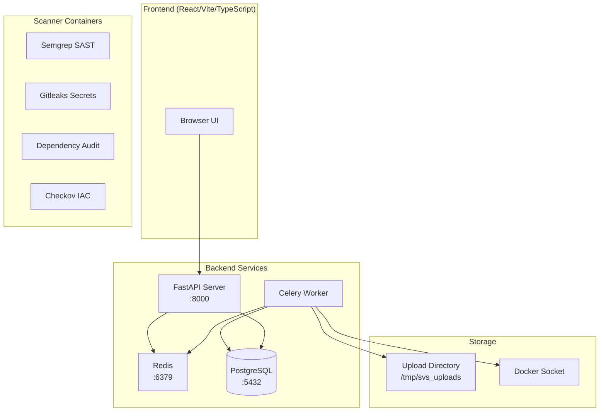
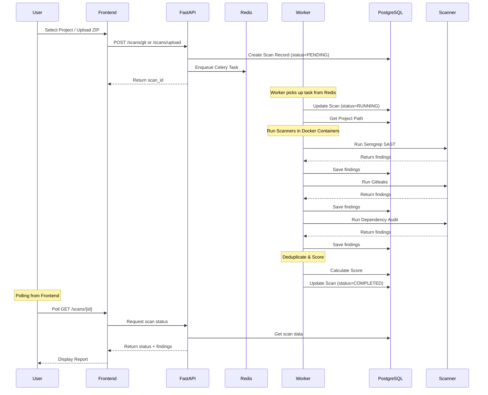
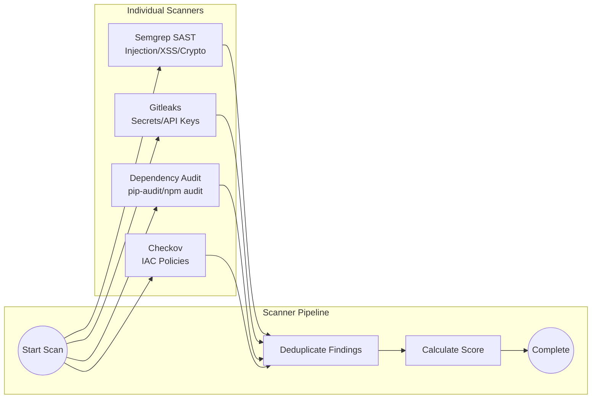
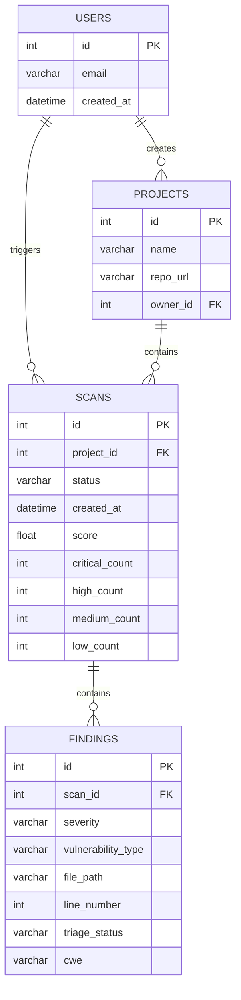
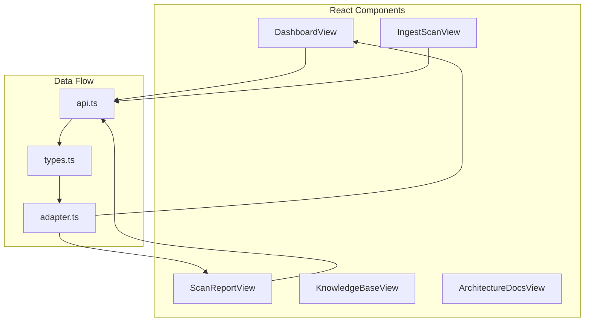
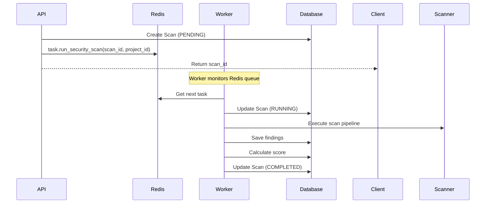
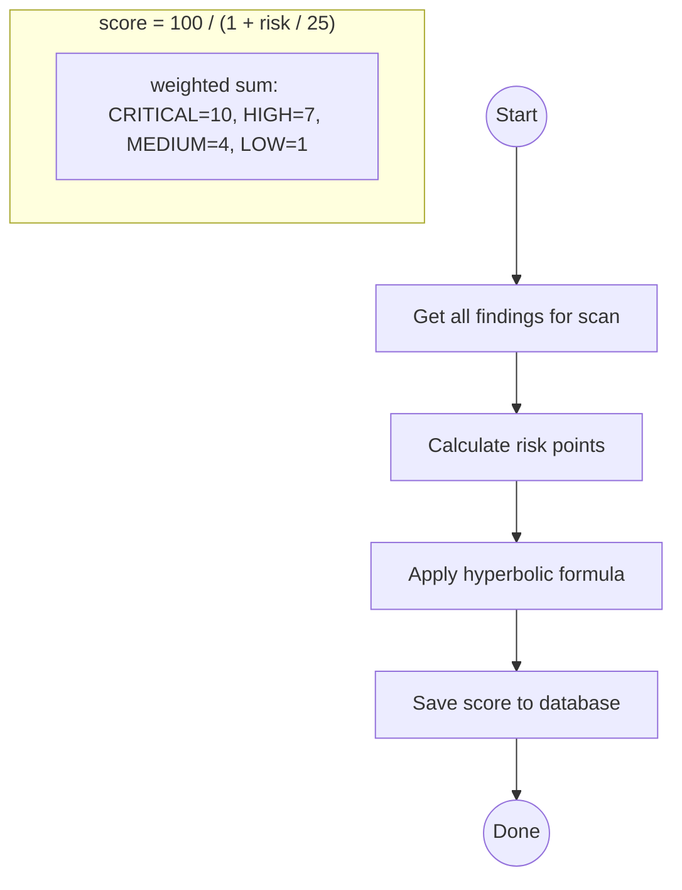
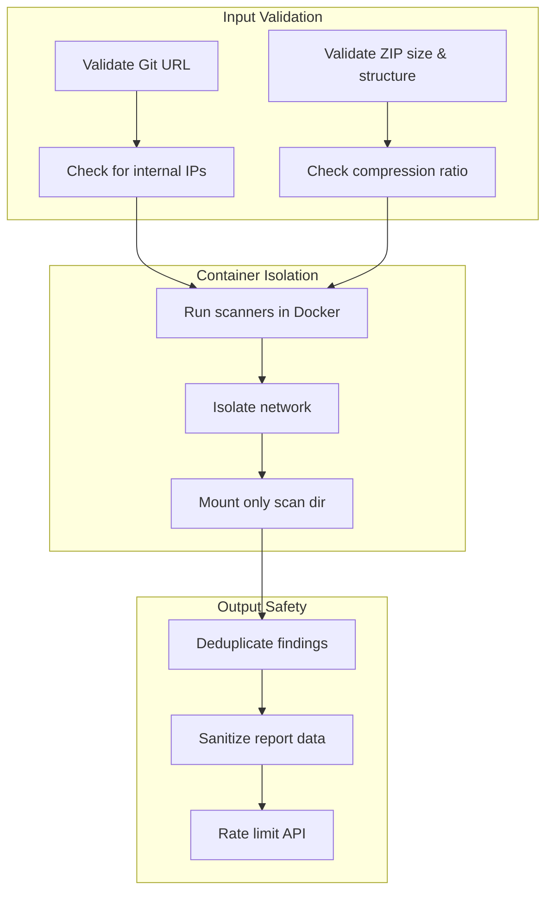

# SVS Code Flow Diagrams

## System Architecture Overview



---

## End-to-End Scan Flow



---

## Scanner Pipeline Flow



---

## Database Schema Flow



---

## API Endpoints Flow

```mermaid
flowchart TD
    subgraph "Project Endpoints"
        P1[GET /projects]
        P2[POST /projects]
    end

    subgraph "Scan Endpoints"
        S1[GET /scans]
        S2[GET /scans/{id}]
        S3[POST /scans/git]
        S4[POST /scans/upload]
        S5[POST /scans/demo]
    end

    subgraph "Finding Endpoints"
        F1[GET /scans/{id}/findings]
        F2[PATCH /scans/{id}/findings/{finding_id}]
    end

    subgraph "Export Endpoints"
        E1[GET /scans/{id}/export]
        E2[GET /scans/{id}/export/sarif]
    end

    P1 --> P2
    S1 --> S2
    S3 --> S4
    S5 --> S2
    F1 --> F2
    E1 --> E2
```

---

## Frontend Component Flow



---

## Celery Task Flow



---

## Score Calculation Flow



---

## Security Flow



---

## Docker Compose Flow

```mermaid
graph TB
    subgraph "Container Dependencies"
        DB[(PostgreSQL)]
        REDIS[(Redis)]
        BACKEND[FastAPI]
        WORKER[Celery Worker]
        FRONTEND[nginx + React]
    end

    FRONTEND --> BACKEND
    BACKEND --> DB
    BACKEND --> REDIS
    WORKER --> DB
    WORKER --> REDIS
    WORKER --> DOCKER
    
    subgraph "Host Integration"
        DOCKER[Docker Socket]
        UPLOADS[/tmp/svs_uploads]
    end

    DOCKER --> BACKEND
    DOCKER --> WORKER
    UPLOADS --> BACKEND
    UPLOADS --> WORKER
```
